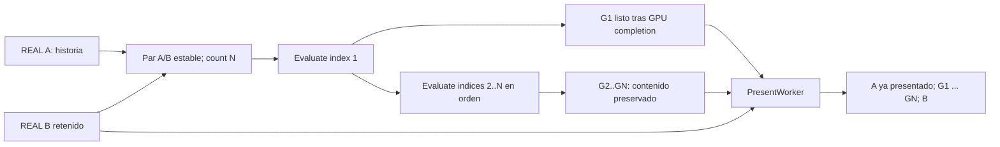

# Auditoría de DLSS-G Multi Frame Generation

Fecha: 2026-10-03. Alcance: documentación, headers y trazas públicas; sin implementación ni ejecución NGX/SM86.

Actualización posterior: [NGX_DLSSG_VULKAN_PROBE.md](NGX_DLSSG_VULKAN_PROBE.md).
La nueva fase autorizada midió stock en RTX3050Ti/Vulkan: Available=0 y max getter
UnsupportedParameter, sin Create/Evaluate. El escenario adaptado sigue sin ejecución.
Las indicaciones NOT QUERIED de esta auditoría describen su estado histórico anterior.

## Resultado

**YES: el contrato oficial requiere una evaluación por índice, sobre el mismo par de frames reales.**
Para N interpolados: count=N constante e índices consecutivos 1..N. El multiplicador es N+1.
La secuencia visible corresponde a `A -> G1 -> ... -> GN -> B`, reteniendo B.
Esta conclusión describe la API; no acredita DLSS-G ni MFG en RTX 3050 Ti/Vulkan.
El instante interno exacto de actualización de historia y el máximo local permanecen sin medir.

AMD_FSR_FG_X2=PASS conservado. No cambios en mods, shaders, bridge AMD, PresentWorker,
ring, interop, configuración o runtime. Sin builds, Minecraft, push/PR ni .minecraft real.

## Fuentes y reproducibilidad

| Fuente | Identificación |
|---|---|
| NVIDIA/DLSS, cuatro headers pedidos | commit 374959484e79a640feaba44c93ac8cfb0a03f5b5 |
| NVIDIA DLSS-FG Programming Guide | mismo commit; documento rotulado SDK **310.7.0**; 128 páginas |
| NVIDIA-RTX/Streamline | commit 2122257e0fce486f91b385aa63b9a09b0a34b363; guía 2.14.1 |
| sdli1995/dlssg_for_sm86 | commit 9621db573e07ed54f50c15bbb585ed9a7bdfac28; documentación 0.3.5 |
| Reportes comunitarios #518 y discusión #546 | capturados como evidencia secundaria; no reproducción propia |

PDF oficial SHA256: `acc65d72d88bc2f226bfef1030ea5a82adc0f318fd1143202fa9e74a7a2d95aa`.
Se verificó contra el Git blob del árbol fijado, se extrajo texto y se inspeccionaron
visualmente las páginas de secuencia. Las páginas indicadas abajo son **páginas físicas
del PDF**; su pie impreso suele tener un número menos.

El PDF 310.7 describe el horizonte 4x de esa edición. No prueba que 310.9 esté limitado
a 4x. La [documentación NVIDIA actual](https://developer.nvidia.com/rtx/dlss) y
[sl_dlss_g.h, líneas 159-164](https://github.com/NVIDIA-RTX/Streamline/blob/2122257e0fce486f91b385aa63b9a09b0a34b363/include/sl_dlss_g.h#L159-L164)
contemplan cinco interpolados/6x en sistemas compatibles. Eso tampoco prueba Ampere.

Herramienta: `D:/ProjectDllsss/tools/audit_dlssg_mfg.py`.
Evidencia: `D:/ProjectDllsss/logs/research/dlssg-mfg/`:
PDF, texto por página, previews, pdf-manifest.json, header-evidence.json,
supplemental-manifest.json, changelog y reportes públicos.
En esta fase MFG: **cero descargas de DLL y cero ejecución de código NVIDIA/comunitario**.
La inspección PE de la fase anterior quedó aislada en logs/research/dlssg-ampere/deep;
no se cargó, instaló ni empaquetó aquella DLL y no se copió de nuevo para esta auditoría.

## Líneas exactas de los headers

Numeración 1-based del archivo original, preservando líneas vacías; no numeración
normalizada de la herramienta web. header-evidence.json conserva hash y ocurrencias.

| Archivo | Líneas | Hallazgo |
|---|---|---|
| [nvsdk_ngx_params_dlssg.h](https://github.com/NVIDIA/DLSS/blob/374959484e79a640feaba44c93ac8cfb0a03f5b5/include/nvsdk_ngx_params_dlssg.h#L42-L48) | 42-48 | count cuenta intermediarios; ejemplos 1=2x, 2=3x; inicializadores count=1 e index=1; index inclusivo 1..count |
| [nvsdk_ngx_defs_dlssg.h](https://github.com/NVIDIA/DLSS/blob/374959484e79a640feaba44c93ac8cfb0a03f5b5/include/nvsdk_ngx_defs_dlssg.h#L350-L365) | 350-359 | max es capability de salida; max=3 significa 4x; count e index son inputs uint32_t para un Real-Frame Pair |
| mismo defs | 361-365 | BackbufferFrameID uint64_t opcional; aumenta una vez por real, incluso con FG desactivado |
| [nvsdk_ngx_helpers_dlssg_vk.h](https://github.com/NVIDIA/DLSS/blob/374959484e79a640feaba44c93ac8cfb0a03f5b5/include/nvsdk_ngx_helpers_dlssg_vk.h#L79-L83) | 79-83 | si OptEvalParams no es null, SetUI pasa count e index al mapa NGX |
| mismo helper Vulkan | 34-45, 68-76, 192 | un output interpolado por llamada, otros outputs opcionales; una llamada final a NVSDK_NGX_VULKAN_EvaluateFeature_C |
| [nvsdk_ngx_helpers_dlssg_d3d.h](https://github.com/NVIDIA/DLSS/blob/374959484e79a640feaba44c93ac8cfb0a03f5b5/include/nvsdk_ngx_helpers_dlssg_d3d.h#L83-L87) | 83-87, 194 | mismo traslado de count/index; termina en NVSDK_NGX_D3D12_EvaluateFeature_C |

Ambos helpers hacen **una** evaluación, sin bucle MFG, sin consultar max y sin
clamp de count. El host controla el bucle. Con OptEvalParams=null no se escriben
estos campos: un mapa reutilizado puede conservar valores anteriores. No confundir
el inicializador C++ con memset a cero ni suponer que null restaura 2x.

## Semántica, rangos y responsables

| Campo | Significado | Rango / default | Responsable |
|---|---|---|---|
| MultiFrameCount | interpolados adicionales por intervalo de dos reales | 1..max efectivo; default 1 | aplicación directa NGX; plugin Streamline si se usa su integración |
| MultiFrameIndex | interpolado de ese grupo que se solicita | 1..count, consecutivo; inicializador 1; modo single usa 1 | mismo host, incrementándolo en cada Evaluate |
| MultiFrameCountMax | máximo de interpolados soportado en el sistema consultado | uint32_t de salida; no default universal 3/5 | NGX/runtime lo informa; host lo consulta; hooks comunitarios pueden modificar lo observado |

La [API Vulkan de capabilities](https://github.com/NVIDIA/DLSS/blob/374959484e79a640feaba44c93ac8cfb0a03f5b5/include/nvsdk_ngx_vk.h#L385-L422)
requiere Init exitoso. El nombre público verificable es
`NVSDK_NGX_VULKAN_GetCapabilityParameters`; el comentario DLSS-G menciona
GetDeviceCapabilityParameters, pero no se inventará una exportación pública con ese nombre.
Leer max con `NVSDK_NGX_Parameter_GetUI` y comprobar también el resultado de esa lectura.

Si `FrameGeneration.Available` no pasa, FG queda deshabilitado aunque se lea un max.
Si FG está disponible y max falta o es menor que 1, el fallback documentado es 1:
**sólo x2**, no habilitar MFG. Max=1 también implica sólo x2.
El valor zero-initialized de DLSSGState no es evidencia de una consulta exitosa.

`count > max`: fuera del contrato. No hay promesa de clamp en NGX; el helper no
lo realiza. Evaluate declara errores genéricos, incluido FAIL_InvalidParameter,
pero no se identificó un resultado obligatorio específico para este caso en todos
los runtimes. No afirmar que lo aceptará, que sólo devolverá un error, o que nunca
afectará el estado. Validar/rechazar en el host antes de Evaluate.

En Streamline, [guía 6.2](https://github.com/NVIDIA-RTX/Streamline/blob/2122257e0fce486f91b385aa63b9a09b0a34b363/docs/ProgrammingGuideDLSS_G.md#L523-L536)
y [header 75-79](https://github.com/NVIDIA-RTX/Streamline/blob/2122257e0fce486f91b385aa63b9a09b0a34b363/include/sl_dlss_g.h#L75-L79):
la aplicación fija numFramesToGenerate; consulta slDLSSGGetState y
numFramesToGenerateMax. El plugin suministra el bucle NGX/presentación internamente.
Su binario prebuilt no publica ese bucle en el árbol auditado; no se afirma haberlo
inspeccionado como fuente. Usando NGX directo lo hará Wisteria, no Streamline.

## Mapeo demostrado

La definición oficial de count y la relación entre frames adicionales/real prueban
`multiplicador = count + 1`; las definiciones de index delimitan las llamadas.
No depende de que un menú de un juego incluya ese multiplicador.

| Multiplicador | Count | Evaluate por intervalo | Índices | Condición mínima |
|---|---:|---:|---|---|
| 2x | 1 | 1 | 1 | FG disponible, max efectivo >=1 |
| 3x | 2 | 2 | 1, 2 | max efectivo >=2 |
| 4x | 3 | 3 | 1, 2, 3 | max efectivo >=3 |
| 5x | 4 | 4 | 1, 2, 3, 4 | max efectivo >=4 |
| 6x | 5 | 5 | 1, 2, 3, 4, 5 | max efectivo >=5 |

**Confirmado como contrato; ninguna fila es un PASS runtime local.**
Los helpers no tienen un límite fijo 5: ese límite actual procede del soporte
documentado de los sistemas/runtime, y debe consultarse; no es un permiso universal.

## Evaluación, posición temporal e historia

Referencias oficiales adicionales: PDF físico 18 y 23 (una salida por Evaluate),
109 (secuencia y fases), 25 (presentación), 119 (capability fallback).

La página 109 especifica que los inputs permanecen iguales durante el grupo,
se recorren todos los índices en orden y count sólo cambia entre pares. Para 4x,
los índices 1/2/3 corresponden a 25/50/75 %. Saltar/reordenar índices es indefinido.
Reset sólo actúa en index=1 y permite iniciar de nuevo una secuencia incompleta.
Estas reglas son comunes NGX y el helper Vulkan transporta los mismos campos.

La interpretación uniforme general `phase = i/(N+1)` concuerda con ese ejemplo
oficial y el pacing solicitado. Para 5x/6x es la fase nominal **derivada**, no
una inspección propia del shader ni una medición de sus píxeles en nuestra GPU.
El autor SM86 también la declara en INSTALL.en.md; su script/evidencia referido
no está publicado en el árbol fijado, así que no puede reproducirse aquí.

En el grupo se preservan color/depth/MV/HUDless/UI y constantes de B respecto de A,
handle, count, frame ID y reset/discontinuity correspondientes al mismo intervalo.
A es historia del feature, no una segunda textura pública que se cambie cada índice.
Los frames G no se reintroducen desde el host como nuevos frames reales.
El timestamp/ID real no avanza por índice. Tras acabar el grupo, el host entrega
el siguiente real C: nuevo intervalo B/C e index vuelve a 1.

**Historia interna:** el feature es opaco. El código público no expone el punto
exacto donde almacena/reemplaza la historia dentro del grupo ni un commitHistory.
No se puede asegurar que una copia interna ocurra únicamente al último índice.
La obligación observable es mantener el par durante 1..N y luego avanzar al siguiente.
Warm-up/reset pueden producir una copia del real: no contar esa copia como FG real.

## Recursos y sincronización Vulkan

El helper acepta VkCommandBuffer y **un** pOutputInterpFrame por evaluación, como
NVSDK_NGX_Resource_VK. El host aporta VkImage/VkImageView, formato, dimensiones y
subresource metadata; VkImage sólo, sin el wrapper, no basta. Backbuffer/depth/MV
son requeridos; HUDless/UI/alpha/distortion son adicionales según modo/metadata.
UI recomposition requiere HUDless y UI o alpha adecuados, además de su flag.
El output debe ser compatible con el backbuffer y apto para escritura.

¿Un VkImage diferente por índice? **No es una exigencia de identidad de la API.**
Sí debe preservarse un contenido independiente para cada G que siga pendiente.
Wisteria puede reservar G1..GN en un pool, o evaluar en un scratch estable y copiar
cada resultado a su lease antes de sobrescribirlo. La segunda opción conserva el
mismo recurso Evaluate durante el grupo; cuesta copias/barriers. El cambio directo
de destino por índice debe validarse en el harness elegido; el contrato no aporta
una regla de asignación/asociación de N imágenes por sí mismo.
Nunca reutilizar almacenamiento aún leído por GPU/presentación.

OutputReal es opcional: retener B con lease o copiarlo una vez. El PDF permite
aportar OutputReal a una sola evaluación del grupo para evitar copias repetidas.
No hace falta el parche comunitario SkipRepeatedRealCopy para ese ahorro.
OutputDisableInterpolation, opcional en headers, necesita buffer de al menos
4 bytes (defs 117-122); primer byte true significa descartar la interpolación.
Conviene conservar una indicación por resultado hasta leerla tras GPU completion.

Evaluate graba trabajo: el retorno CPU no garantiza escritura GPU terminada.
Los comandos de índices/historia deben ejecutarse ordenados. El host sincroniza
inputs y escrituras, entrega outputs con semaphore/fence y libera tras uso final.
No asumir que NGX sincroniza dos colas o que un handle admite evaluación paralela.
G1 puede presentarse al completarse sin esperar GN. El backend directo no adquiere
swapchain ni presenta: esas acciones siguen perteneciendo a PresentWorker.

## Consulta de máximos: evidencia y límites

| Runtime / contexto | Máximo | Calidad de evidencia |
|---|---|---|
| 310.1.0.0, variante comunitaria | techo declarado 3 (4x) | INSTALL.en.md 18-22 y 91; no consulta propia stock/local |
| 310.9.1.0, variante comunitaria | techo declarado 5 (6x) | mismas líneas; requiere backend/kernel e integración compatibles |
| 310.9.1.0, RTX3090/D3D12, reporte #518 | hook dice original_max=5 y reported_max=2 | extracto de traza pública; configuración MaxGeneratedFrames=2; no reproducción ni log completo propio |
| 310.9.1, RTX3090/D3D12, discusión #546 | cap visible 3 | MaxGeneratedFrames=3; Create exitoso y luego crash, sin Evaluate; no prueba de FG |
| 310.1 / 310.9.1, RTX3050Ti/Vulkan local | **UNKNOWN / NOT QUERIED** | no bridge FG operativo demostrado ni consulta guardada; no ejecutado en esta auditoría |

[#518](https://github.com/sdli1995/dlssg_for_sm86/issues/518) identifica runtime hash
ff6e90eb78b827927dff5b4ecc6b1c870c2e9bca29ed9f48c7d348cc9e170b82.
Su etiqueta original_max pertenece al hook del autor: no equivale a una consulta
stock independiente. El texto atribuye el límite al plugin, pero la traza también
muestra que el mod altera 5 a 2; no permite aislar esa atribución. Además max=2
significa capacidad semántica 3x, aunque el juego siga solicitando count=1/2x.
[#546](https://github.com/sdli1995/dlssg_for_sm86/discussions/546) distingue claramente
capability/create success de kernel/ejecución exitosa.

El DLL local nvngx_dlss.dll de **Super Resolution** no prueba una capability FG;
el runtime relevante es nvngx_dlssg.dll. No intercambiar sus versiones/queries.

Procedimiento futuro de medición, descrito **sin ejecutar ni implementar**:

1. Registrar GPU real/UUID/LUID, driver, HAGS, API, versión+SHA del runtime FG y
   SDK/NGX core, plugins/perfiles/overrides, hook/backend y configuración.
2. Con Init exitoso del dispositivo elegido, GetCapabilityParameters; guardar
   result codes y valores originales Available, FeatureInitResult, NeedsUpdatedDriver,
   min driver, MultiFrameCountMax. Diferenciar getter fallido de valor cero.
3. Si hubiera hook adaptado, registrar por separado valor antes/después del hook;
   si hubiese Streamline, consultar también su numFramesToGenerateMax.
4. Calcular capacidad efectiva para el host según NGX verificado y recursos reales,
   sin convertir un techo de pool en capability de GPU. Después validar cada N.

No existe una consulta local guardada ni un harness NGX FG operativo validado:
el JNI NGX falta en los JAR baseline y la conexión adaptada SM86/Vulkan no está
demostrada. Obtener una medición nueva exigiría preparar/cargar infraestructura
GPU fuera de esta auditoría estática. La ejecución comunitaria permanece detenida.
No se fabrican números para cubrir ese hueco.

## Qué modifica el máximo efectivo

| Factor | Efecto distinguible |
|---|---|
| GPU/arquitectura | soporte oficial FG RTX40/50; MFG RTX50/Blackwell compatible; RTX30 no oficial |
| Driver / sistema | requisitos y flags Available/NeedsUpdatedDriver; la configuración puede impedir soporte |
| Runtime FG | versión del algoritmo y su techo, no el de DLSS SR |
| Backend SM86 | adaptación de kernels/ABI/rutas debe funcionar; puede alterar lo reportado |
| Streamline plugin | puede limitar options y gestionar outputs/pacer; su estado es otro nivel de capability |
| Integración del juego | qué count solicita, buffers disponibles, overrides/menús y pacing; max alto no obliga a generar N |
| Wisteria/PresentWorker | pool/backpressure/presentación propia condicionan lo que puede consumirse; no cambian el algoritmo NVIDIA |

Separar MFG **fijo** de **Dynamic MFG**. Streamline 2.14.1 documenta Dynamic como
D3D12-only y driver >=595.41, y no autoriza inferir Dynamic Vulkan.
Eso no elimina los campos de MFG fijo de NGX Vulkan ni demuestra su ejecución SM86.
Changelog: 2.7.2 introduce MFG; 2.11.0 introduce Dynamic; release 2.11.1 lo anuncia.
El autor comunitario pide plugin >=2.11.1 para su 6x probado; no se prueba que sea
el mínimo universal de todo MFG ni una dependencia del camino **NGX directo**.

## Auditoría secundaria de sdli: 4x / 6x

[INSTALL.en.md](https://github.com/sdli1995/dlssg_for_sm86/blob/9621db573e07ed54f50c15bbb585ed9a7bdfac28/docs/INSTALL.en.md#L91-L116)
y README describen techo 3 en 310.1, 5 en 310.9.1, mientras la configuración default
anuncia 3. MaxGeneratedFrames limita capability; no genera ni presenta por sí solo.
ForceGeneratedFrames modifica getters de count, no setters ni la secuencia del host.
ForcePluginFrames intenta elevar un plugin antiguo, pero el autor reporta cierre FG
por buffers insuficientes. Su 6x requiere integración nueva y backend adaptado.
Es evidencia de límites de integración, no código Vulkan reproducible.

El reporte #518 muestra count/index reales 1/1 frente al getter forzado a 2:
no se obtienen dos fases sólo cambiando el máximo/getter. No se inferirá un nuevo
kernel MFG porque el contador de UI o feature-create sea exitoso.

El árbol fijado carece de código y de documentos referenciados MFG_PROBE.md,
ARCHITECTURE.md y scripts de reproducción. No se auditó una implementación
publicada de sus hooks MFG: sólo documentación y reportes identificados.
No se copió ni ejecutó ningún binario comunitario durante esta fase.

## Encaje esperado con Wisteria, sin modificarlo

A no se presenta por segunda vez al iniciar cada grupo: ya pertenece al intervalo
anterior. Durante generación se retiene B; se muestra después de GN. El host
asigna plazos aproximadamente uniformes usando tiempos de los reales; el índice
elige la fase del algoritmo, no el timestamp de una nueva simulación del juego.

El adapter NGX existente contiene un bucle consecutivo (líneas 211-235) y consulta
Available/max (351-379), con MAX_GENERATED_FRAMES=5 como **techo de implementación**,
no como query exitosa. Está sin validar en RTX3050Ti; no se activó ni editó.
NgxVulkan.java 394-395 transporta count/index. No basta para declarar listo SM86.

PresentWorker es compatible **conceptualmente** con outputs offscreen y leases.
No se cambia ni se certifica hoy su comportamiento MFG; los gates AMD x2 conservados
no validan N>1 NVIDIA. Antes de ampliar: probar x2 escrito/no duplicado y sincronización,
luego cada N con count/present order/fases/VRAM/pacing/error, sin saltar multiplicadores.

## Gate y bloqueos conservados

API semantics=CONFIRMED. ONE_EVALUATE_PER_INDEX=YES. VULKAN_FIELD_TRANSPORT=CONFIRMED.
RTX3050Ti NGX FG init/create/evaluate/output=PENDING; X2..X6 NVIDIA=NOT TESTED.
No PASS inferido de AMD, headers, exports o feature creation comunitario.

Bloqueos: RTX30 fuera de soporte oficial; no adaptación Vulkan SM86 reproducible;
faltan firmas/estructuras versionadas y contrato de instalación del backend
DlssgMod_GetInfo/DlssgMod_Install/SM86Bridge_Install; kernels/ABI y resource wrapping
no demostrados para NGX Vulkan. Permisos de carga/redistribución de runtime/modelos
adaptados pendientes. Nada de esto se resuelve hardcodeando max=5 o spoofing solo.

La siguiente investigación es obtener ese contrato reproducible y resolver permisos;
no implementar SM86 ni ejecutar ahora. DLSS SR queda fuera del objetivo de esta fase.

## Integridad

La verificación de archivos conservados confirma los mismos SHA256:

| Artefacto | SHA256 |
|---|---|
| Super Resolution fg-backpressure JAR | 20fa05a42731692d5c20aa2cd82d7ff1367febc4fc1261fcad1a3a3c478c0896 |
| Wisteria fsr-backpressure JAR | ac16837b0447d14f4cdff4ed00c75bb84feb2a80a87d261f690b47914f5a8e53 |
| wisteria_fsr_bridge.dll | b0388beb885271fafa59e788bb4f9c2ce7d508ae4ecb11879b113a7f0d043f7b |

Sólo se añadieron herramienta documental, snapshots de fuentes y documentación.
La verificación fue estática; no se repitió ningún gate runtime aprobado.
