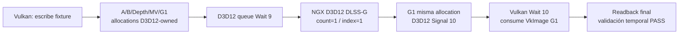

# Vulkan → D3D12 DLSS-G → Vulkan x2: PASS

Run único `20261003-233010-719`, 2026-10-03 UTC. Base local/GitHub
`bd25bef3ea065b291a743837c140abfd77997bff`, rama `main`.

```ini
VULKAN_DLSSG_D3D12_VULKAN_X2=PASS
DLSSG_VULKAN_SIDECAR_END_TO_END=PASS
MINECRAFT_INTEGRATION_READY=YES_FOR_NEXT_PHASE
GENERATED_COUNT_CONFIRMED=1
```

El alcance es un harness offscreen sintético, 1280×720, RTX 3050 Ti Laptop,
Windows x64, driver 596.49. El PASS reúne los dos gates históricos, sin volver
a ejecutarlos por separado: DLSS-G D3D12 x2 `20261003-222208-087` e interop
D3D12-owned `20261003-230013-062`. Vulkan NGX directo permanece cerrado en
`FAIL_AT_KERNEL_CREATION`; ninguna llamada NGX Vulkan se ejecutó en este run.

La próxima fase puede diseñar una interfaz aislada para Wisteria. Aquí se
detuvo el trabajo: Minecraft, Wisteria runtime, PresentWorker y x3–x6 no se
ejecutaron ni modificaron. Este resultado no valida pacing o presentación
de juego, persistencia de sesiones, resize, HUD real ni todas las escenas.

## Flujo demostrado



Las cinco allocations funcionales nacen en D3D12 DEFAULT/SHARED/UAV y se
importan directamente en Vulkan. No hay traducción Vulkan/Dzn ni copia a otra
texture para adaptar el handoff. No hay GPU→RAM→GPU entre APIs.

La fixture CPU existente produce los datos fuente, permitidos explícitamente
por el apartado 11 del encargo; buffers upload de Vulkan alimentan
`vkCmdCopyBufferToImage`. Vulkan GPU escribe las propias imágenes compartidas.
D3D12 recibe exactamente los mismos ID3D12Resource exportados, y NGX escribe
el mismo G1 que Vulkan importa. El único upload D3D12 es el sentinel de 16 bytes
del flag diagnóstico `OutputDisableInterpolation`, sin datos de imagen.

## Identidad y recursos

Ambas APIs usan NVIDIA GeForce RTX 3050 Ti Laptop GPU. Vulkan UUID
`01895b66d1ca454d88788dd21fdef638`, LUID `4c29010000000000`. La selección
rechaza otra GPU. `SAME_GPU=PASS`.

| Recurso | D3D12 / Vulkan | Función NGX | Shared / misma allocation |
|---|---|---|---|
| A | RGBA8_UNORM / R8G8B8A8_UNORM | historia del real 3 | PASS / YES |
| B | RGBA8_UNORM / R8G8B8A8_UNORM | real 4, backbuffer y HUDless | PASS / YES |
| Depth | R32_FLOAT / R32_SFLOAT | depth del real actual | PASS / YES |
| MV | R32G32_FLOAT / R32G32_SFLOAT | current→previous NDC | PASS / YES |
| G1 | RGBA8_UNORM / R8G8B8A8_UNORM | interpolado offscreen | PASS / YES |

Cada formato/extent/usage se consultó individualmente. Usage Vulkan
`TRANSFER_SRC|TRANSFER_DST|SAMPLED|STORAGE` (15), optimal tiling, mip/layer/sample1.
Todos devolvieron `IMPORTABLE|DEDICATED_ONLY` (features5), image bits3, handle
bits2, intersección2 y type1 DEVICE_LOCAL. Allocate/import/bind result0 por
recurso, allocation dedicada y offset0. Punteros, handles, formatos y requisitos
individuales constan en `resource-map.json` y `worker-result.json`.

El HANDLE Win32 es `D3D12_RESOURCE`, no HEAP ni exportación Vulkan. La cadena
de allocation usa `VkImportMemoryWin32HandleInfoKHR` y
`VkMemoryDedicatedAllocateInfo(image)`. La aplicación cierra cada NT HANDLE
después de importar; D3D12 y VkDeviceMemory conservan referencias al payload
hasta completion. [La importación no consume el HANDLE de la aplicación](https://docs.vulkan.org/refpages/latest/refpages/source/VkImportMemoryWin32HandleInfoKHR.html).

## Protocolo de sincronización

Fence D3D12 `SHARED`, importado permanentemente en Vulkan como timeline
`D3D12_FENCE`, flags0. Query timeline importable, feature habilitada. Para cada
intervalo `f=0..4`, Vulkan signal `2f+1`, D3D12 queue Wait del mismo valor,
DLSS-G Evaluate, D3D12 Signal `2f+2`, Vulkan queue Wait del mismo valor.
El target usa **9→9** y **10→10**. `sync-map.json` y eventos preservan los cinco
intervalos y sus submits/completions. No CPU wait entre producer y consumer
en ninguna de las dos direcciones.

Vulkan realiza acquire/release de ownership `EXTERNAL↔queueFamily`, layout
GENERAL, access masks/barriers explícitos. La primera adquisición descarta
contenido UNDEFINED y escribe todos los inputs. D3D12 recibe COMMON, transiciona
inputs a NON_PIXEL_SHADER_RESOURCE y G1 a UNORDERED_ACCESS; después de Evaluate
ejecuta UAV barrier y devuelve todos a COMMON. Vulkan adquiere G1/GENERAL y
copia sólo a buffers terminales de validación. Los eventos registran las
transiciones individuales.

COMMON/GENERAL es el protocolo observado en esta GPU/driver; no se presenta
como equivalencia universal garantizada por ambas APIs. La tabla Vulkan de
layouts externos implícitos enumera D3D11, no D3D12. Se conserva esa limitación
del [contrato externo de recursos](https://docs.vulkan.org/spec/latest/chapters/resources.html).

Hay CPU waits acotados **después** del consumidor Vulkan de cada warmup, para
reciclar allocator/command buffers/uploads. No ordenan el handoff. CreateFeature
tiene su completion de setup, anterior al flujo de frames. Todas las lecturas
CPU de contenido ocurren al final: seis readbacks Vulkan (A/B/depth/MV/sentinel/G1),
un flag D3D12 y dos readbacks de timestamps. `VALIDATION_CPU_READBACK_COUNT=9`,
`BRIDGE_TRANSPORT_CPU_COPY_COUNT=0`, `CPU_WAIT_BETWEEN_APIS=NO`.

## NGX, backend y generación

Contrato público ya validado: INI local, `LoadLibraryW(dlssg_sm86.dll)`, módulo
residente durante el proceso. No llamadas/deducciones de ABI privada desde
el harness. No Streamline, OptiScaler, swapchain, DRS ni perfiles globales.

- sdli0.3.5 SHA256:
  `c3934a09399f022504227c72df0bf8c0de55f9a08880dddde898c5262cefa838`.
- Runtime suministrado y efectivo 310.9.1.0 SHA256:
  `ff6e90eb78b827927dff5b4ecc6b1c870c2e9bca29ed9f48c7d348cc9e170b82`.
- Backend extraído por el loader SHA256:
  `1aebf8f306fbaede18c98b372da9c70a1bbdb1bd35327f7f85c2969085a619a1`.

El loader redirige al runtime de su bundle local, cuyo hash coincide exactamente
con el runtime suministrado. Esto se registra tanto en los logs como en los
hashes de módulos efectivos del manifest. No se redistribuyen esos binarios.

NGX D3D12 Init, AllocateParameters, CreateFeature y Evaluate devuelven
`0x00000001`. Handle de feature `000001D7D94AB6F8`. Public replacement keys
Width/Height y demás opciones son los del PASS D3D12 previo. Warmup reales
0,1,2,3; reset sólo en0. Target real4, count1/index1, cámara fija D3D12, jitter0,
depth/motion/camera coherentes. A termina con real3, B con real4.

Los logs observan instalación activa y **64 creaciones de kernels reales**,
todas status0. `D3D12_KERNEL_CREATE=PASS_OBSERVED`; diagnósticos sin imagen,
entry ni shader se guardan aparte y no se cuentan como kernels. Referencias
de archivo/línea/raw constan en `result.json`.

Capabilities reportadas Available1 / FeatureInitResult1 / Max1, provenance
`REPORTED_POTENTIALLY_HOOKED`; ningún valor participa como prueba de generación.
El gate combina feature, kernels, ejecución/completion, output y validez temporal.

## Readback y contenido temporal

| Readback | SHA256 |
|---|---|
| A | 9285dff3162262072b299c4cbe94b40e9e51280c27ef9f7e38a08abe730cc140 |
| B | 4acff001b7f04ce1ce503314fbdd0dfadc6f2cf87d843dcf12365319bf387baa |
| Sentinel | 80ebb6cf65541911010912a1a2d2d35cb683f935d1f0b15dc8748f84d473c586 |
| G1 | b5261cc3c32720a2e4178611c9cb25d5cb964e4b554eeb6b449ec311f7993a3e |
| Depth | 7fea35808b0f7d554be9857f6a8e416b386e79d962c12987801e76e384477efc |
| MV | 3bb90bb24e18c2acd0bb61772f0c8725d629bda4bb2bf1c24c553c52a38eb895 |

Todos los inputs y el sentinel coinciden byte por byte con la fixture conocida.
G1 cambia 42424 píxeles frente A y42757 frente B; ningún pixel del sentinel,
ningún píxel incorrecto de fondo según el reducer. Objeto42907 píxeles, centroid
x451.408675/y359.481273, entre los reales443.5/459.5; RGB MAE frente midpoint
ideal0.298147. `TEMPORAL_CONTENT_VALID=PASS`, flag disable0, generated_count1.
Se inspeccionó también la imagen G1 preservada: fixture completa, sin negro ni
corrupción grave. El hash coincide con el G1 del PASS D3D12 previo, sin imponer
esa coincidencia como condición de aceptación. No se cuentan outputs warmup.

## Timings y límites de validación

| Scope | Resultado |
|---|---|
| Vulkan inputs GPU, target | 3.873824 ms |
| DLSS-G Evaluate D3D12 GPU, target | 3.958784 ms |
| Vulkan consumidor/readbacks GPU, target | 3.357536 ms |
| Vulkan→D3D12 handoff aislado | UNKNOWN |
| D3D12→Vulkan handoff aislado | UNKNOWN |
| Harness total CPU wallclock | 5308.808600 ms |

Timestamps GPU locales por API: Vulkan64bits/period1ns, D3D12 queue1GHz.
El scope Vulkan inputs incluye copia GPU de la fixture y snapshot sentinel;
el scope consumidor copia los cinco recursos, no sólo G1. El total CPU incluye
setup, warmup, logging y validación, no es latencia de juego. No se suman clocks
de distintas APIs ni se infiere tiempo de handoff sin calibración común.
[D3D12 timestamp frequency y queries se interpretan por queue](https://learn.microsoft.com/en-us/windows/win32/direct3d12/timing).

Worker exit0, timeoutfalse, una ejecución principal, ningún retry. D3D12 debug
enabled, errores0; warning1328 de initial state de buffer diagnóstico, preservado.
Vulkan debug-utils errores observados0, **Khronos validation no disponible**:
no se afirma validación Vulkan completa. Device lostfalse/removedfalse/reason0.

## Evidencia y preservación

Directorio local:
`D:/ProjectDllsss/logs/runtime/dlssg-vk-d3d12-x2/20261003-233010-719/`.
Manifest, result, worker checkpoint, CPU tests, events, capabilities, resource/
handle/sync maps, NGX callbacks, backend/loader logs, D3D12 debug, Vulkan debug,
hashes y timings están preservados. Readbacks BIN y previews PPM/PNG permanecen
locales e ignorados por Git; sólo texto/JSON/hashes y source propio se suben.

Build Release x64/MSVC19.51/MT PASS; CPU fixture/reducer/camera/depth/intersección
de memoria/checkpoint lock recovery PASS, y tests del reducer de evidencia
rechazan capabilities-only, duplicados, kernels ausentes, sync incorrecto,
CPU transport y device loss. La única prueba GPU se realizó después de ellos.

SHA256 baselines antes/después idénticos:

- Super Resolution JAR: `20fa05a42731692d5c20aa2cd82d7ff1367febc4fc1261fcad1a3a3c478c0896`.
- Wisteria JAR: `ac16837b0447d14f4cdff4ed00c75bb84feb2a80a87d261f690b47914f5a8e53`.
- AMD bridge: `b0388beb885271fafa59e788bb4f9c2ce7d508ae4ecb11879b113a7f0d043f7b`.

AMD_FSR_FG_X2=PASS histórico intacto; PresentWorker, ring fix y bridge GL/Vulkan
existente intactos. No `.minecraft` real, runtimes de juego ni distribución de
binarios comunitarios/NVIDIA modificados. Publicación sólo al origin autorizado
`https://github.com/Micchael710/Dlss.git`, sin PR/force push/upstream.

## Continuación a Wisteria — candidato preparado

Nueva implementación experimental wisteria:dlssg con device/NGX/pool persistentes,
GPU handoffs sin CPU wait entre APIs y leases compatibles con PresentWorker.
Shadow conserva sólo presentación real; readbacks G1 diagnósticos se ejecutan
sobre la VkImage importada. Builds Java21/C++ y CPU contract/JNI tests PASS;
Minecraft shadow y x2 presentados aún NOT_RUN. El PASS end-to-end anterior no se
extrapola a inputs de Minecraft. Baseline AMD íntegra, sin rerun de este harness.

## Minecraft integration shadow — failed before NGX, no presentation attempt

Run20261004-010600-001, candidate milestone621546f. Real Minecraft inputs captured;
own JNI and external public loader pass. D3D12CreateDevice fails0x887A0007 during
SESSION_INIT. NGX Init/CreateFeature/kernels/Evaluate/G1 not reached. Generated0.
Historical offscreen VULKAN_DLSSG_D3D12_VULKAN_X2=PASS remains distinct from
MINECRAFT_DLSSG_SHADOW_X2=FAIL. MINECRAFT_DLSSG_X2_PRESENTATION=NOT_RUN_SHADOW_GATE_FAILED.
One attempt, no automatic retry/fix/second GPU run, no x3–x6. World saved/normal shutdown,
isolated config restored, baseline hashes unchanged. All timing/visual FG quality and
frame-order claims stay NOT_MEASURED/NOT_TESTED. Suspected late EnableDebugLayer is
medium-confidence hypothesis, not confirmed private backend failure. See integration
document and logs/runtime/minecraft-dlssg-x2/20261004-010600-001/result.json.
